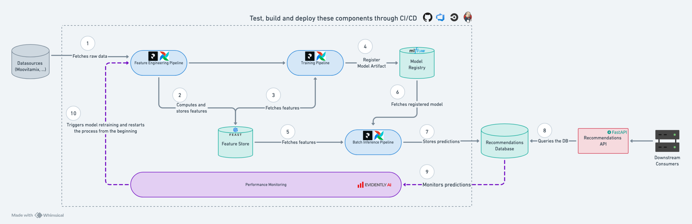

<!-- Inscrivez vos réponses dans ce document -->

## ⚙ Instructions d'installation du projet

1. S'assurer que Python est bien installé sur la machine. Ce projet est compatible avec python `>=3.9, <=3.13`. Il a été testé en Python 3.10

2. Créer un environement virtuel nommé `venv` :
    ```shell
    python -m venv venv
    ```

3. Lancer l'environement virtuel :
    ```shell
    source venv/bin/activate
    ```

4. Installer `poetry` pour la gestion des dépendances du projet :
    ```shell
    pip install poetry && pip install --upgrade pip
    ```

5. Lancer l'installation du projet via `poetry` :
    ```shell
    poetry install
    ````

6. A ce stade, le projet est installé et prêt à être lancé. Commençons par lancer la suite de tests via `pytest` pour s'assurer que tout fonctionne : 
    ```shell
    pytest -rA
    ```
    Un total de 5 tests unitaires doivent passer avec succès.
    
    Par manque de temps je n'ai pas pu implémenter tous les tests qui me semblaient nécessaire. J'ai quand même pris le temps d'en mettre en place au moins un pour montrer la marche à suivre

## ⚡ Lancement de l'extraction des données

1. S'ouvrir un terminal en arrière fond en s'assurant de bien être à la racine du projet `technical-test-data-engineer` et en activant l'environement virtuel, puis lancer le serveur API Moovitamix localement : 
    ```shell
    python -m uvicorn src.moovitamix_fastapi.main:app --reload
    ```

2. S'ouvrir à présent un nouveau terminal de travail, toujours à la racine du projet `technical-test-data-engineer` et lancer la pipeline d'ingestion, dans un premier temps, sans le module d'orchestration : 
    ```shell
    python src/moovitamix_data_connector/main.py --scheduling no
    ```
    La pipeline va lancer 3 flux d'ingestions: `tracks`, `users` et `listen_history`. Une fois l'exécution terminée, les données seront sauvegardées dans le dossier `data/01_source`

3. Pour activer le module d'orchestration `prefect` : 

    - S'assurer que `prefect` est bien installé en roulant la commande suivante :
        ```shell
        prefect version
        ```
    - Ouvrir un nouveau terminal en arrière fond pour lancer le serveur localement :
        ```shell
        prefect server start
        ```
        L'adresse du dashboard local s'affiche, normalement `http://127.0.0.1:4200`
    - Ouvrir un nouveau terminal de travail pour lancer la pipeline d'ingestion avec le module d'orchestration
        ```shell
        python src/moovitamix_data_connector/main.py --scheduling yes
        ```
    - Se rendre sur le dashboard à l'adresse affichée précedemment pour suivre le lancement des runs à chaque minute et leur état (sous l'onglet `Deployments`).
    
        Pour l'instant le projet n'implémente pas de méthodologie de versioning, les données sont donc extraites et écrasées à chaque minute sous `src/01_source`.

## 📖 Description des choix techniques du projet

Globalement, le projet se découpe en 7 thématiques techniques :

1. Setup du projet
2. Connecteur API Moovitamix
3. Modèle de données
4. Orchestration

Nous allons en explorer les choix, remarques et prochaines étapes.

### 1. Setup du projet

- Toutes les composantes sont codées en Python pour faciliter la collaboration avec l'équipe Data Science qui travaille principalement avec ce language. L'utilisation du SQL notamment pour le module de transformation de données est également une option valide à explorer

- J'ai utilisé `poetry` pour la gestion des dépendances du projet. Sa capacité à résoudre les dépendances automatiquement, centraliser en un seul fichier les configurations de dév et de prod, centraliser les commandes de build ainsi qu'encapsuler la gestion des dépendances et de l'environement virtuel en font un outil très robuste en comparaison à une utilisation manuelle de `pip`

- Le projet est découpé en 3 modules techniques sous `src` :
    1. `moovitamix_fastapi` : Module de création de l'API (fourni par MoovAI)
    2. `moovitamix_data_connector` : Connecteur de données visant à extraire les données `source` de l'API Moovitamix
    3. `data_transformation` : Module responsable de la création des pipelines de transformation de données de la couche `source` à la couche `mart`

### 2. Connecteur API Moovitamix

- Le connecteur se trouve dans `src/moovitamix_data_connector.py`

- J'ai fait le choix de le coder from scratch bien que d'autres options sur étagère et beaucoup plus robustes existent afin d'éviter de réinventer la roue :
    * Créer un connecteur `Airbyte`
    * Créer un connecteur `Kedro`
    
    Cela s'explique notamment par 2 raisons:
    
    1. un manque de temps pour rentrer dans la doc de ses solutions respectives qui offrent un template prêt à l'usage pour créer des connecteurs personnalisées mais nécessite d'adhérer à leur modèle de données pour en tirer profit
    
    2. Les connecteurs génériques de type API HTTP de ces 2 solutions n'offrent pas la gestion de la pagination et/ou de gestion du retry en cas de dépassement de la limite de l'API

- Le connecteur gère la pagination de l'API

- Le connecteur gère pour l'instant uniquement les erreurs de type 429 (rate limit error)

- Le connecteur implémente un mechanisme de validation de données à l'aide de `Pydantic`. Qui implémente pour l'instant exclusivement la validation du typage. Une des petites limitations de Pydantic ici est le fait qu'il n'offre pas de solution DataFrame-like permettant d'évaluer la validité des données au niveau du Dataframe Pandas lors du runtime. Une solution comme `pandera` pourrait être une bonne alternative pour améliorer cela pour étendre, simplifier et robustifier le scope de la validation

- Prochaines étapes:
    * Présentemment, le connecteur se réalise systématiquement une extraction de données en mode "full load". Cela n'est pas très performant ici car pour ce type de données on peut s'imaginer que la volumétrie peut très vite grossir ce qui rendra une extraction de type incrémentale beaucoup plus performante du point de vue du cout et du temps. On devra donc réfléchir à l'avenir à l'implémentation d'une telle feature
    * Explorer l'éventualité d'adhérer à un framework offrant des connecteurs sur-étagère beacoup plus robuste afin d'éviter de réinventer la roue
    * Etendre la gestion des erreurs à plus de code HTML pour le rendre plus robuste

### 3. Modèle de données

#### 3.1 Structuration du pipeline de transformation de données

J'ai tiré mon modèle de données des best practices provenant des frameworks open source utilisés par la communauté, notamment [dbt](https://docs.getdbt.com/best-practices/how-we-structure/1-guide-overview). La donnée passe par 3 couches de transformation:

1. Source: Donnée brute sans transformation
2. Staging: Couche où sont appliquées les transformations de base de notre modèle de données (ex: casting, cleaning, ...)
3. Mart: Couche où se trouve les modèles de données utilisés par le business, l'équipe Data Science. Ils définissent l'unique source of truth qui permet d'alimenter l'ensemble des cas d'usage analytiques plus bas dans le pipeline (ex: on y définit ce qu'est un utilisateur, ce qu'est un track, ...)

Par manque de temps, j'ai eu la possibilité d'explorer uniquement la couche source qui est la couche où les données extraites par le connecteur API atterissent. Si demain on décide d'intégrer une nouvelle source de données comme une base de données SQL, c'est dans cette couche qu'atterisseront aussi les tables de cette BD.

Pour cet exercice, il n'y a pas énormément de transformation à appliquer sur les données, les modèles développés dans ces différentes couches auraient été légers. Si j'avais eu davantage de temps j'aurais utilisé `Kedro` pour réaliser ces transformations. Sa solution de pipelining et de visualisation des jobs de transformation de données le rend très efficace.

#### 3.2 Structuration du modèle de données

Etant donnée la nature du problème, j'ai opté pour une modélisation en étoile (star schema) avec les composantes suivantes:

* `tracks` : table de dimension
* `users` : tables de dimension
* `listen_history` : table de fait

plus d'info dans les [best bractices dbt](https://docs.getdbt.com/terms/dimensional-modeling)

### 4. Orchestration

- J'ai utilisé `Prefect` car moins verbeux qu'une solution comme `Airflow`. Avec le peu de temps que j'ai, j'ai préféré opté pour cette solution pour implémenter rapidement une soltuion d'orchestration. L'inconvénient d'une solution comme `Prefect` est sa maturité relativement faible en comparaison à `Airflow` qui est la solution la plus populaire dans l'écosystème Python.

- Ma solution n'implémente pas pour l'instant de versioning, à chaque run du job les données fraiches viendront écraser les anciennes données. Si j'avais plus de temps j'aurais d'abord commencé par analyser les différentes options à ma disposition pour implémenter ce versioning. Cela peut passer par différentes possibilités comme:
    - un format de données qui gère by design les versions (ex: delta lake qui est du parquet sous stéroide)
    - une structure de fichier/dossier qui conserve la tracabilité (ex: un dossier par date, avec un dossier `latest` contenant en tout temps la version la plus à jour des données)

### 5. Monitoring de la santé du pipeline

#### 5.1 Le monitoring, à quoi ça sert ?

Le monitoring de la santé du pipeline est un point important car il permet en tout temps de savoir si la pipeline de données fonctionne comme convenu. 
Cela couvre des questions comme :
    
* La pipeline s'est elle bien lancée ?
* Il y a t-il eu des erreurs/warnings ?
* Le temps d'exécution de ma pipeline a t-elle été plus long que d'habitude ?
* La qualité des données ingérées est-elle conforme à l'attendu

Pour être pleinement robuste, une pipeline de données doit être équipée d'une couche de monitoring qui aidera à apporter les réponses à ces questions.

#### 5.2 Comment y arriver ?

Avant de penser à une solution de monitoring en particulier, il est important de s'assurer de la mise en place d'un ensemble de must-haves :

* Émission de logs et de métriques: Une pipeline qui génère un ensemble de logs et de métriques CLAIRS et PERTINENTS sur la santé de l'éxecution de la pipeline. Ceci doit être fait de manière centralisée afin d'en faciliter le traitement à postériori. Rien de pire que devoir réconcilier différents flux de logs/métriques vivant à différents endroits...

* Collecte et stockage: les logs, les métriques et l'historique des exécutions sont des informations qui doivent être collectées et stocker de manière sécuritaire par la solution de monitoring

* Qualité de données: un ensemble de tests doivent être mis en place pour s'assurer du niveau de qualité des données (schéma de données, complétude, exactitude, fraicheur, ...)

* Observabilité: Une solution de dashboarding simple d'utilisation permettant de visualiser les logs, les métriques et l'historique des runs

* Infrastructure fiable: qu'elle soit hostée ou managée, la solution choisie doit garantir la disponibilité, l'accessibilité, la scalabilité et la sécurité de la solution et des données. Cet outil est une tour de controle qui doit être fiable en tout temps.

* Alerting: sur la base des métriques collectées, définir des seuils qui permettront de déclencher des alertes automatisées

#### 5.3 Quelles métriques observer ?

Il y a énormément de métriques qui peuvent être implémentées dépendemment de contexte et de l'infrastructure. Globalement je les décomposerai en 3 catégories:

1. Qualité de données
    * Nombre de tests de données en erreur/succès
    * Taux de doublons
    * Taux de valeurs manquantes

2. Performance
    * Quantité de données ingérées
    * Temps d'exécution
    * Usage CPU
    * Usage Mémoire

3. Erreurs
    * Nombre/Taux d'erreurs (peut être décomposer par types d'erreur: validation de donnée, compute, ...)
    * Nombre de warnings

Sur la base de ces métriques nous pouvons définir seuils qui vont déclencher des alertes automatisées. Ceci peut être accompagné d'un système de reporting générant un rapport templatisé et envoyé à la fréquence de notre choix (ici quotidienne) via des canaux adaptés (courriel, slack, ...)

### 6 et 7. Automatisation du calcul des recommendations

Je vais répondre dans cette section à la fois à la question 6 et 7.

Nous avons traité dans les parties précédentes le volet données, nous allons à présent nous intéresser à la partie modélisation et architecture.

Avant de se lancer dans l'implémentation du système de recommandation, il convient d'abord de concevoir l'architecture du système au global. Nous parlons ici de système car le livrable final est une solution ML, plutôt complexe, et composée de différentes composantes qui communiquent les unes avec les autres.

Revenons tout d'abors au besoin client. Nous voulons créer un système pour recommander à nos utilisateurs des listes de lecture. Pour concevoir la solution, nous devons prendre en compte différents aspects qui n'ont pas nécessairement été évoqué par le client:

1. A quelle fréquence vont être servies les recommendations de listes de lecture ? Je vois au moins 2 scénarios basiques :
    
    - 1.1. On met à jour les recommendations d'un utilisatuer à chaque nouvelle mise à jour de son historique (ex: après l'écoute d'un nouveau titre). L'avantage est que l'utilisateur se voit constamment proposer de nouvelles recommendatins fraiches. L'inconvénient est que cela est très gourmand en ressource et nécessite des choix d'architecture plus complexes qui font notamment entrer en jeu des composantes streaming pour permettre une interrogation du modèle en temps réel.

    - 1.2. On met à jour les recommendations d'un utilisateur à une fréquence régulière (ex: à chaque 24h). L'avantage est que l'inférence se fait en mode batch, beaucoup moins gourmandes en ressources. L'inconvénient est que les recommendations ne sont pas les plus fraiches. A noter que dans ce cas de figure, les recommendations seront pré-crunchées pour tous les utilisateurs de la base, ce qui peut être très coûteux. Il existe des stratégies pour diminuer le coût, par exemple, générer les recommendations que pour les clients actifs et/ou les tops clients.

2. Quelle est l'interface qui va être responsable de servir les prédictions ? BD, API, fichiers plats (csv, parquet, ...) ? Afin de répondre à cette question, il faut notamment comprendre quels sont les systèmes downstream qui vont consommer les prédictions (web app, mobile, job, ...). En règle générale, lorsqu'il s'agit d'intégrer un modèle de ML à des systèmes complexes, le principal challenge est de le rendre intéropérable. Dans ce genre de cas de figure, l'utilisation d'API pour exposer un modèle sous forme de service tout en abstrayant sa complexité, est une solution de choix. Pour garantir la robustesse du système, les recommendations pourraient d'abord être inscrits dans une BD une fois le batch d'inférence terminé puis l'API serait chargée uniquement d'interroger la BD pour collecter les résultats

3. Quelle est la fréquence de ré-entrainement du modèle ? On fait l'hypothèse ici que le modèle est réentrainé de manière automatique que lorsque les performances du modèle chutent.

Si on prend un peu de hauteur, décider sur ces composantes d'architecture, ça revient finalement à arbitrer entre 3 composantes: à quelle fréquence est servi le client, à quelle vitesse et pour quel coût.

Parfait! Sur la base d'hypothèses, qu'il faudrait dans un contexte réel vérifier bien sûr avec le client, nous venons de définir quelques concepts clés de notre solution. Voici à présent une liste des composantes possibles de ce système (tous ces composants ne sont pas indispensables):

1. Une pipeline de feature engineering (collecte, cleaning et enrichissement des données)
2. Une pipeline d'entraînement du modèle (comprenant également l'évaluation et la validation du modèle)
3. Une pipeline d'inférence
5. Model registry: en charge de conserver l'historique des modèles utilisés et de tagger le modèle de référence
6. Feature Store: magasin de features en charge de stocker les features et d'éviter de les recalculer lorsqu'elles ont déjà été calculées dans le passé et sont disponibles
7. Service de serving (API): module en charge de servir les prédictions, via API, en lisant la BD populée par la pipeline d'inférence
8. Module de monitoring: Connecté au module de serving il est en charge de mesurer en temps réel la performance du modèle et de détecter de potentiels chutes de performance (drift)
9. CI/CD: Pour automatiser l'intégration, le build et le déploiement de la solution dans l'infrastructure cible
10. (Une dernière composante que je mets un peu entre parenthèses dépendemment du besoin de l'équipe DS et du niveau de maturité de ce qui est souhaité: une plateforme d'expérimentation permettant à l'équipe d'itérer sur leurs modèles tout en gardant l'historique des itérations)

Voici un diagramme très simplifié décrivant ce processus avec quelques solutions sur le marché permettant de répondre aux besoins :



Pour automatiser le réentrainement du modèle de recommendation nous avons besoin de 4 éléments:

1. Une couche de monitoring ayant accès à l'historique des prédictions
2. Une métrique permettant de mesurer la performance réelle du modèle en production. C'est peut être une des étapes la plus complexe, étant donné qu'il est assez chalengeant de mesurer la performance d'une recommendation car n'il y a pas de ground truth. Quelques pistes:
    * mettre en place une feedback loop active avec les utilisateurs (ex: like, dislike, ...) permettant d'avoir un signal sur la validité de cette recommendation
    * mettre en place une feedback loop passive permettant de mesurer si la recommendation a fait son effet (ex: la musique a été écoutée, pendant un certain temps long, ...)
    * mettre en place une feedback loop à base de règle d'affaires qui permettent de qualifier la validité de la recommendation (ex: si la playlist est assez variée tout en gardant une cohérence avec le profil de l'utilisateur, alors c'est un succès)
3. Définir des règles/seuils permettant de qualifier le type de drift pour lequel on veut déclencher un réentrainement
4. Définir la mécanique de déclenchement et connecter la solution de monitoring à notre solution d'orchestration